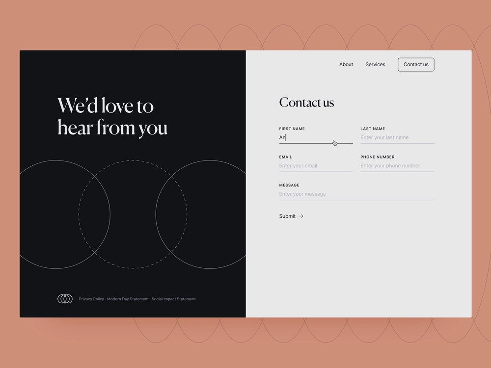

# Headless 적응형 Forms 시작하기

이 튜토리얼에서는 Headless 적응형 양식을 만들기 위한 전체적인 프레임워크를 제공합니다. 자습서는 사용 사례와 여러 안내서로 구성됩니다. 각 안내서는 이 자습서에서 만든 Headless 적응형 양식에 새로운 기능을 학습하고 추가하는 데 도움이 됩니다. 모든 안내서 다음에 작동하는 Headless 적응형 양식이 있습니다. 이 자습서를 마치면 다음을 수행할 수 있습니다.

* Headless 적응형 양식 만들기
* 양식에 비즈니스 규칙 추가
* Google 재질 UI를 사용하여 양식 스타일 지정
* 양식 미리 채우기
* 양식을 웹 페이지에 임베드

또한 Headless 적응형 양식의 아키텍처, 사용 가능한 아티팩트 및 JSON 구조에 대한 이해를 구축하려고 합니다.

**사용 사례 학습으로 여정 시작**:

자연미가 뛰어나고 관광 경제가 번창하는 것으로 알려진 나라의 외교부 회원인 Raya Tan은 관광객들에게 비자 양식 배포를 감독한다. 이러한 양식은 부서의 웹 사이트, 기본 모바일 앱 및 PDF 형식에서 사용할 수 있으며, 관광객들이 선택할 수 있는 다양한 언어 옵션이 있습니다. 그러나 이러한 양식을 다양한 플랫폼과 기술에 걸쳐 관리하고 확장하는 것은 어려울 수 있습니다.

비자 신청 프로세스의 효율성과 유연성을 향상시키기 위해 외무부에서는 Headless 적응형 양식 접근 방식을 채택하기로 결정했습니다. 이렇게 분리된 아키텍처는 프론트엔드와 백엔드를 분리하므로 사용자 정의 및 확장성을 높일 수 있습니다. 부서는 Google Material UI의 React 구성 요소를 사용하여 양식의 사용자 경험을 향상시킬 계획입니다. 또한 다음과 같은 백엔드 기능을 사용합니다.

* 디지털 서명
* 데이터 통합
* 비즈니스 프로세스 관리
* 기록 문서
* 사용 분석

관광객들이 가장 많이 찾는 형태는 각종 질문과 질문을 할 때 사용하는 &#39;연락처&#39; 양식이다. 따라서 외무 부서에서는 이 양식을 사용하여 Headless 적응형 양식 접근 방식을 구현하도록 선택했습니다. 이 튜토리얼에서는 이 새로운 아키텍처를 사용하여 연락처 양식을 만드는 과정을 안내합니다. 최종 결과는 다음과 같습니다.

