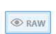

# 첫 번째 Headless 적응형 양식 만들기

Adobe Experience Manager Headless 적응형 양식을 사용하여 React와 같은 프론트엔드 UI를 사용하여 양식 애플리케이션을 구축하고, 상태 관리, 유효성 검사 및 다양한 다른 터치포인트와의 통합과 같은 기능에 Forms Web SDK를 사용할 수 있습니다.

예를 들어 조직 We.Org는 고객 등록 여정을 디지털화하려고 합니다. 개발자들은 Angular을 사용하여 프론트엔드 솔루션을 구축하는 데 능숙합니다. 양식 유효성 검사 및 전자 서명을 특수 솔루션으로 오프로드하는 동안 사용자 지정 프런트 엔드를 구축하고자 합니다.

Adobe Experience Manager Headless 적응형 양식은 조직이 프론트엔드 언어에 대한 기존 전문 지식을 사용하여 양식을 자유롭게 작성하는 동시에 백엔드 기능을 사용하여 엔터프라이즈급 양식 경험을 생성할 수 있도록 지원합니다.

<!-- >>[!VIDEO](https://video.tv.adobe.com/v/341011/) -->

<!--   -->

## 시작하기 전

* 로컬 컴퓨터에서 Headless 적응형 양식을 만들고 테스트할 수 있도록 [개발 환경](setup-development-environment.md)을 설정하십시오.
* 로컬 개발 컴퓨터에 다음 소프트웨어를 설치해야 합니다.
   * [Java 개발 키트 11](https://experience.adobe.com/#/downloads/content/software-distribution/en/general.html?1_group.propertyvalues.property=.%2Fjcr%3Acontent%2Fmetadata%2Fdc%3AsoftwareType&amp;1_group.propertyvalues.operation=equals&amp;1_group.propertyvalues.0_values=software-type%3Atoling&amp;fulltext=Oracle%7E+JDK%7E+11%7E&amp;orderby=%40jcr%3Acontent%2Fjcr%3AlastModified&amp;orderby.sort=desc&amp;layout=list&amp;p.offset=0&amp;p.limit=14)
   * [Git 최신 릴리스](https://git-scm.com/downloads). Git을 처음 사용하는 경우 [Git 설치](https://git-scm.com/book/en/v2/Getting-Started-Installing-Git)를 참조하십시오.
   * [Node.js 16.13.0 이상](https://nodejs.org/en/download/). Node.js를 처음 사용하는 경우 [Node.js 설치 방법](https://nodejs.dev/en/learn/how-to-install-nodejs)을 참조하세요.
   * [Maven 3.6 이상](https://maven.apache.org/download.cgi) Maven을 처음 사용하는 경우 [Apache Maven 설치](https://maven.apache.org/install.html)를 참조하십시오.


## Archetype 프로젝트를 사용하여 Headless 적응형 양식 만들기

Archetype 프로젝트는 Maven 기반 템플릿입니다. Headless 적응형 양식을 시작하기 위한 모범 사례를 기반으로 최소 프로젝트를 만듭니다. 또한 Forms as a Cloud Service 및 로컬 개발 환경에 대한 Headless 적응형 양식 기능이 포함되어 있습니다. 베타 단계 동안 Archetype 37 이상 기반 프로젝트를 생성하고 배포해야 합니다. Post-Beta 프로젝트는 맞춤화에만 필요합니다.

첫 번째 Headless 적응형 양식을 만들고 렌더링하려면 다음 단계를 수행하십시오.

1. [AEM Archetype 기반 프로젝트 생성 및 배포](#create-an-archetype-based-project)
1. [AEM SDK에 프로젝트 배포](#deploy-the-project-to-a-local-development-environment)
1. [Headless 적응형 양식의 JSON 스키마를 만들고 AEM SDK 인스턴스에 업로드합니다.](#create-add-json-representation-of-headless-adaptive-forms)
1. [핵심 구성 요소가 포함된 빈 템플릿을 기반으로 적응형 양식 만들기](#create-adaptive-form-with-blank-with-core-components-template)


### 1. AEM Archetype 기반 프로젝트 만들기 및 배포 {#create-an-archetype-based-project}

운영 체제에 따라 아래 명령을 실행하여 Experience Manager Forms as a Cloud Service 프로젝트를 만듭니다. Archetype 버전 37 이상을 사용합니다. 최신 버전의 Archetype을 찾으려면 [Archetype 설명서](https://experienceleague.adobe.com/docs/experience-manager-core-components/using/developing/archetype/overview.html)를 참조하세요.

**Microsoft Windows**

1. 관리자 권한으로 명령 프롬프트를 엽니다(관리자 권한으로 명령 프롬프트 또는 bash 셸 실행).
1. 아래 명령을 실행합니다.

   ```shell
     mvn -B org.apache.maven.plugins:maven-archetype-plugin:3.2.1:generate ^
     -D archetypeGroupId=com.adobe.aem ^
     -D archetypeArtifactId=aem-project-archetype ^
     -D archetypeVersion=37 ^
     -D appTitle=myheadlessform ^
     -D appId=myheadlessform ^
     -D groupId=com.myheadlessform ^
     -D includeFormsenrollment="y" ^
     -D includeFormsheadless="y" 
   ```

   * `appTitle`을(를) 설정하여 제목 및 구성 요소 그룹을 정의합니다.
   * `appId`을(를) 설정하여 Maven artifactId, 구성 요소, config 및 콘텐츠 폴더 이름 및 클라이언트 라이브러리 이름을 정의합니다.
   * `groupId`을(를) 설정하여 Maven groupId 및 Java Source 패키지를 정의합니다.
   * 응용 Forms을 만드는 데 필요한 Forms 관련 구성, 테마, 템플릿, 핵심 구성 요소 및 종속성을 포함하려면 `includeFormsenrollment=y` 옵션을 사용하십시오.
   * Headless 적응형 Forms 기능을 포함하는 데 필요한 Forms 핵심 구성 요소 및 종속성을 포함하려면 `includeFormsheadless=y` 옵션을 사용하십시오. 이 옵션을 활성화하면 다음 항목이 포함됩니다.
      * [핵심 구성 요소](https://experienceleague.adobe.com/docs/experience-manager-core-components/using/introduction.html?lang=ko-KR)가 있는 **핵심 구성 요소가 있는 빈** 템플릿입니다.
      * 프런트 엔드 React 모듈 `ui.frontend.react.forms.af`입니다. React 앱에서 Headless 적응형 양식을 렌더링하는 데 도움이 됩니다.


**Apple macOS 또는 Linux**:

1. 터미널을 루트 사용자로 엽니다. 관리자 권한으로 명령을 실행할 수 있습니다. 터미널 창을 연 후 `sudo root` 명령을 사용하여 관리 권한이 있는 명령을 실행할 수도 있습니다.
1. 아래 명령을 실행합니다.

   ```shell
     mvn -B org.apache.maven.plugins:maven-archetype-plugin:3.2.1:generate \
     -D archetypeGroupId=com.adobe.aem \
     -D archetypeArtifactId=aem-project-archetype \
     -D archetypeVersion=37 \
     -D appTitle=myheadlessform \
     -D appId=myheadlessform \
     -D groupId=com.myheadlessform \
     -D includeFormsenrollment="y" \
     -D includeFormsheadless="y"  
   ```

   * `appTitle`을(를) 설정하여 제목 및 구성 요소 그룹을 정의합니다.
   * `appId`을(를) 설정하여 Maven artifactId, 구성 요소, config, 콘텐츠 폴더 이름 및 클라이언트 라이브러리 이름을 정의합니다.
   * `groupId`을(를) 설정하여 Maven groupId 및 Java Source 패키지를 정의합니다.
   * 응용 Forms을 만드는 데 필요한 Forms 관련 구성, 테마, 템플릿, 핵심 구성 요소 및 종속성을 포함하려면 `includeFormsenrollment=y` 옵션을 사용하십시오.
   * Headless 적응형 Forms 기능을 포함하는 데 필요한 Forms 핵심 구성 요소 및 종속성을 포함하려면 `includeFormsheadless=y` 옵션을 사용하십시오. 이 옵션을 활성화하면 다음 항목이 포함됩니다.
      * [핵심 구성 요소](https://experienceleague.adobe.com/docs/experience-manager-core-components/using/introduction.html?lang=ko-KR)가 있는 **핵심 구성 요소가 있는 빈** 템플릿입니다.
      * 프론트엔드는 모듈 `ui.frontend.react.forms.af`에 응답합니다. React 앱에서 Headless 적응형 양식을 렌더링하는 데 도움이 됩니다.

명령이 완료되면 `appID`에 지정된 이름의 프로젝트 폴더가 만들어집니다. 예를 들어 값이 `myheadlessform`인 `appID`을(를) 사용하면 이름이 `myheadlessform`인 폴더가 만들어집니다. 여기에는 Archetype 기반 프로젝트가 포함되어 있습니다.


### 2. AEM SDK에 프로젝트 배포 {#deploy-the-project-to-a-local-development-environment}

AEM SDK 인스턴스에 프로젝트를 배포하면 Headless 적응형 Forms 기능, 핵심 구성 요소가 포함된 **빈 항목** 템플릿 및 프로젝트에 포함된 기타 리소스가 개발 환경에 추가됩니다. <!-- Deploy the project to your local development environment to locally create Headless Adaptive Forms. or deploy directly to your Forms as a Cloud Service environment. !--> AEM SDK 인스턴스에 배포하려면:

1. 명령 프롬프트를 엽니다. Windows를 사용하는 경우 관리 권한으로 명령 프롬프트를 엽니다(관리자 권한으로 명령 프롬프트 실행 또는 [Git bash 셸](https://khushwantsehgal.wordpress.com/2022/06/29/check-if-git-bash-is-running-in-administrator-mode/)).

1. 이전 단계에서 생성된 프로젝트 디렉토리로 이동합니다. 예, `/myheadlessform`

   

1. 다음 명령을 실행합니다.

   ```shell
   mvn -PautoInstallPackage clean install
   ```

   &#39;빌드 성공&#39; 메시지를 기다립니다.
   

   종속성을 해결하고 프로젝트를 배포하는 데 시간이 오래 걸릴 수 있습니다. 프로젝트를 배포하지 못하는 경우 일반적인 문제 및 해결 방법에 대해서는 [문제 해결](troubleshooting.md) 문서를 참조하십시오.


<!-- *  To learn how to deploy code to AEM as a Cloud Service, see the video in [Deploying to AEM as a Cloud Service]https://experienceleague.adobe.com/docs/experience-manager-cloud-service/content/implementing/deploying/overview.html?lang=en#coding-against-the-right-aem-version) article : -->


### 3. headless 적응형 양식의 JSON 스키마를 만들고 AEM SDK 인스턴스에 업로드합니다 {#create-add-json-representation-of-headless-adaptive-forms}

Headless 적응형 Forms은 JSON 파일로 표시됩니다. [스토리북](https://opensource.adobe.com/aem-forms-af-runtime/storybook/?path=/story/reference-examples--contact)에서 샘플 양식을 가져오거나 `[Archetype Project]\ui.content\src\main\content\jcr_root\content\dam\myheadlessform\af_model_sample.json`의 Archetype 프로젝트에 포함된 샘플 양식을 사용할 수 있습니다. 이 문서는 스토리북의 [소개](https://opensource.adobe.com/aem-forms-af-runtime/storybook/?path=/story/reference-examples--introduction) 양식을 사용합니다. Headless 적응형 Forms을 빠르게 시작하는 데 도움이 되는 단일 필드 양식입니다. <!-- The [specifications](/help/assets/Headless-Adaptive-Form-Specification.pdf) document provides detailed information about various components, rules, and constraints for Headless Adaptive Forms -->

스키마를 만들고 업로드하려면:

1. 확장명이 `.json`인 일반 텍스트 파일을 만듭니다. 예, `myfirstform.json`. 파일 시스템 또는 `\<project-name>\ui.content\src\main\content\jcr_root\content\dam\myheadlessform\<formname>.json`의 AEM Archetype 기반 프로젝트에서 원하는 위치에 파일을 만들 수 있습니다
1. `.json` 파일에 다음 JSON 콘텐츠를 추가하고 저장합니다.

   ```JSON
   {
     "adaptiveform": "0.10.0",
     "items": [
       {
         "fieldType": "text-input",
         "label": {
           "value": "Enter your Name"
         },
         "name": "textInput"
       }
     ],
     "metadata": {
       "grammar": "json-formula-1.0.0",
       "version": "1.0.0"
     }
   }
   ```

   양식에 단일 필드를 추가합니다.

   

1. [로컬 AEM SDK 인스턴스에 로그인](setup-development-environment.md#setup-author-instance)
1. Adobe Experience Manager > Forms > Forms 및 문서로 이동합니다. 만들기 > 파일 업로드 를 누릅니다.
1. 2단계에서 만든 `.json`을(를) 선택하고 업로드하십시오. Headless 적응형 양식을 만들 준비가 되었습니다. .json 파일을 `\<project-name>\ui.content\src\main\content\jcr_root\content\dam\myheadlessform\<formname>.json`의 AEM Archetype 기반 프로젝트에 저장하는 경우. `mvn -PautoInstallPackage clean install`을(를) 사용하여 AEM SDK에 프로젝트를 배포하고 `<formname>.json`과(와) 함께 배포할 수 있습니다.

`.json`을(를) 업로드하는 데 실패한 경우 [AEM Archetype 프로젝트가 배포되었는지 확인](#deploy-the-project-to-a-local-development-environment)하십시오.

<!-- 1. Open the [contact form](https://opensource.adobe.com/aem-forms-af-runtime/storybook/?path=/story/reference-examples--contact) and tap the [](faq.md#storybook-example) icon on bottom-right side of the Storybook page to view the source code of the headless . 

You can use [Adaptive Forms builder extension for Visual Studio Code](/help/setup-development-environment.md#microsot-visual-studio-code-extension-for-headless-adaptive-forms) to build a JSON schema of your Headless Adaptive Forms. 

You can see [Storybook](https://opensource.adobe.com/aem-forms-af-runtime/storybook/?path=/story/reference-examples--introduction) for sample JSON schemas and list of components, attributes, and properties. You can also see the [specifications document](/help/assets/Headless-Adaptive-Form-Specification.pdf) for detailed information on all the components, constraints, and methods available to define Headless Adaptive Forms.

File extension of a JSON schema of Headless Adaptive Forms is .json. For example, formname.json. Create or add the file to your AEM Archetype based project. For example, `\myheadlessform\ui.content\src\main\content\jcr_root\content\dam\myheadlessform\home-loan.json` -> 

### 3. Deploy the project to a local development environment {#deploy-the-project-to-a-local-development-environment}

You can deploy the project to local development environment. It adds Headless Adaptive Forms functionality, the **Blank with core components** template, JSON schema of form, and other resources included in the project to your development environment. <!-- Deploy the project to your local development environment to locally create Headless Adaptive Forms. or deploy directly to your Forms as a Cloud Service environment. To deploy to your local development environment, use the following command: 

    `mvn -PautoInstallPackage clean install`

If you are on Windows, run the above with Administrative privileges (Run command prompt or [bash shell as an administrator](https://khushwantsehgal.wordpress.com/2022/06/29/check-if-git-bash-is-running-in-administrator-mode/)). For the complete list of commands, see [Building and Installing](https://experienceleague.adobe.com/docs/experience-manager-core-components/using/developing/archetype/using.html?lang=en#building-and-installing).
    
<!-- *  To learn how to deploy code to AEM as a Cloud Service, see the video in [Deploying to AEM as a Cloud Service]https://experienceleague.adobe.com/docs/experience-manager-cloud-service/content/implementing/deploying/overview.html?lang=en#coding-against-the-right-aem-version) article : -->

### 4. 빈 핵심 구성 요소 템플릿을 기반으로 적응형 양식 만들기 {#create-adaptive-form-with-blank-with-core-components-template}

1. [AEM SDK 인스턴스](http://localhost:4502/)에 로그인합니다.

1. Adobe Experience Manager > Forms > Forms 및 문서로 이동합니다.

1. 만들기 를 누르고 적응형 양식을 선택합니다. **핵심 구성 요소가 있는 공백** 템플릿을 선택하고 [만들기]를 탭합니다.

   

1. 다음 속성 필드에 대한 값을 지정합니다. 제목 및 이름 필드는 필수입니다.

   * **제목**: 양식의 표시 이름을 지정합니다. 제목을 통해 Experience Manager Forms 사용자 인터페이스에서 양식을 식별할 수 있습니다.
   * **이름**: 양식 이름을 지정합니다. 이름이 지정된 노드가 저장소에서 만들어집니다. 제목 입력이 시작되면 이름 필드 값이 자동으로 생성됩니다. 제안 값을 변경할 수 있습니다. 이름 필드에는 영숫자 문자, 하이픈 및 밑줄만 포함될 수 있습니다. 잘못된 모든 입력은 하이픈으로 대체됩니다.

1. 만들기 를 누릅니다. 적응형 양식이 만들어집니다.

**핵심 구성 요소가 있는 빈 구성 요소** 템플릿이 표시되지 않으면 [AEM Archetype 프로젝트가 배포되었는지 확인](#deploy-the-project-to-a-local-development-environment)하십시오.

### 5. JSON 스키마를 사용하도록 적응형 양식 구성 {#configure-adaptive-form-to-use-the-JSON-representation}

이전 단계에서 만든 적응형 양식이 비어 있습니다. JSON 스키마를 사용하도록 적응형 양식을 구성하십시오.

1. [AEM SDK 인스턴스](http://localhost:4502/)에 로그인합니다.

1. Adobe Experience Manager > Forms > Forms 및 문서로 이동합니다. 이전 단계에서 만든 적응형 양식을 선택하고 편집 을 누릅니다. 편집기에서 적응형 양식이 열립니다.

1. 적응형 Forms 컨테이너 구성 요소를 탭하고 속성 을 탭합니다. 사이드바에 속성 탐색기가 표시됩니다.

1. 속성 탐색기에서 기본 아코디언을 확장하고 Forms 런타임 문서 경로 옵션에 대해 이전 단계에서 업로드한 JSON 스키마의 경로를 지정합니다. 컨테이너 구성 요소에는 양식의 렌디션이 표시됩니다.

1. 속성 탐색기에서 제출 아코디언을 확장하고 적응형 양식에 대한 제출 액션을 설정합니다. React 앱에서 양식을 사용할 준비가 되었습니다.

1. 로컬 개발 컴퓨터에서 호스팅하여 양식을 렌더링하려면 다음을 수행하십시오.

   1. `[Archetype project]\ui.frontend.react.forms.af\.env` 파일을 열고 양식 경로를 설정합니다. 예: /content/forms/af/contact

   1. 명령 프롬프트를 열고 ui.frontend.react.forms.af 프로젝트로 이동한 후 다음 명령을 실행합니다.

      `npm run start`

   1. 완료되면 브라우저 창에서 localhost:3000을 열어 렌더링된 Headless 적응형 양식을 봅니다.
   1. 제출 기능을 테스트하려면 AEM Forms 서버에 로그인한 다음 **HTML에서 양식 미리 보기** 옵션을 사용하여 미리 보기 모드에서 양식을 엽니다.

[스토리북](https://opensource.adobe.com/aem-forms-af-runtime/storybook/)은(는) Headless Adaptive Forms의 JSON 스키마의 일부 예와 함께 다양한 Headless Adaptive Forms에 설정할 수 있는 구성 요소 및 규칙 목록을 제공합니다. [사양](/help/assets/Headless-Adaptive-Form-Specification.pdf) 문서를 검토하여 Headless 적응형 Forms과 관련된 다양한 규칙 및 속성에 대해 알아볼 수도 있습니다.
