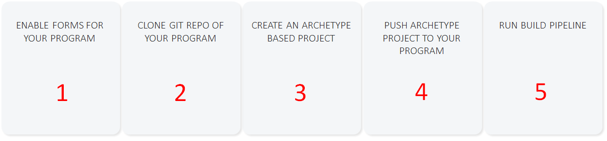
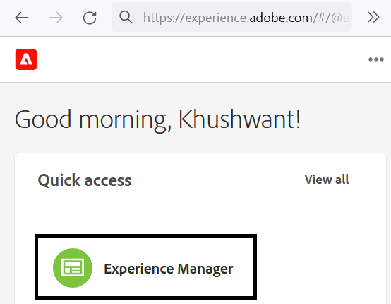
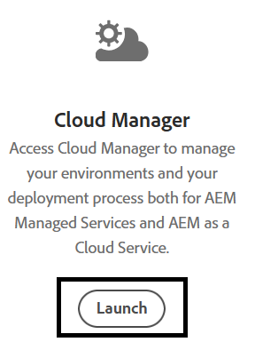
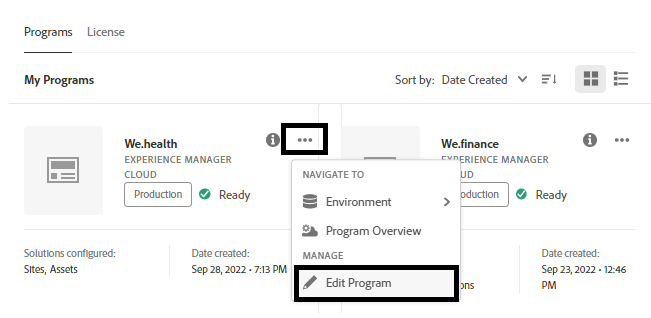
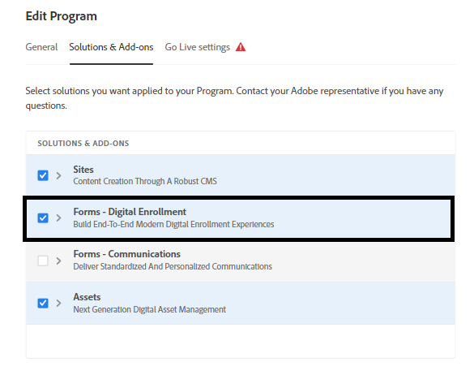
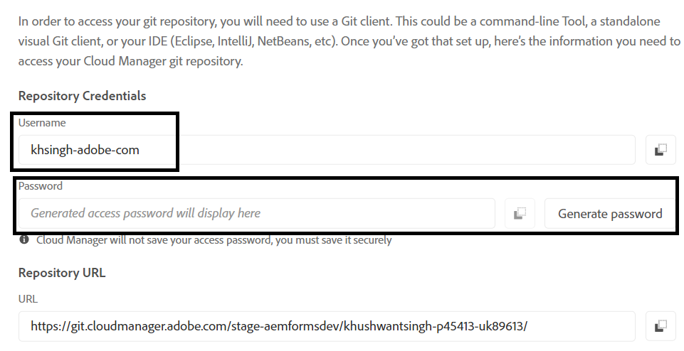
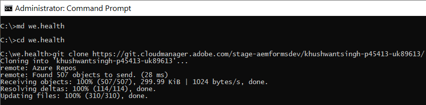
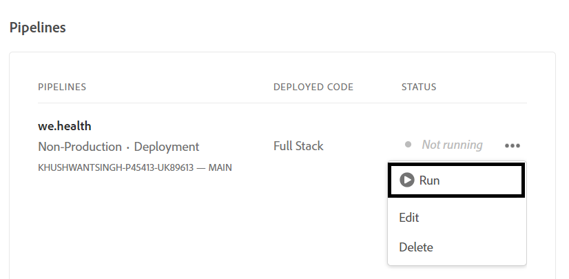

# Cloud Service에서 Headless 적응형 양식을 위한 개발 환경 설정

<span class="preview"> 이 문서는 **진행 중인 작업**.</span>입니다.


Cloud Service에서 Headless 적응형 양식을 작성하고 테스트할 준비가 되셨습니까? Cloud Service 프로그램에 Forms을 활성화하고 계속 진행하십시오.

## 시작하기에 앞서

* 로컬 컴퓨터에 [최신 버전의 Git](https://git-scm.com/downloads)을(를) 설치합니다. Git을 처음 사용하는 경우 [Git 설치](https://git-scm.com/book/en/v2/Getting-Started-Installing-Git)를 참조하십시오. Git 저장소를 사용하여 로컬 개발 환경에서 개발된 양식 및 사용자 지정 코드를 Cloud Service 개발 환경에 푸시합니다.

* 로컬 컴퓨터에 [Node.js 16.13.0 이상](https://nodejs.org/en/download/)을(를) 설치합니다. <!-- URL IS 404! If you are new to Node.js, see [How to install Node.js](https://nodejs.org/en/learn/how-to-install-nodejs). -->


* AEM as a Cloud Service 프로그램 만들기: [프로그램 만들기](https://experienceleague.adobe.com/ko/docs/experience-manager-cloud-service/content/onboarding/demo-add-on/create-program#create-program) 문서의 1-7단계에 따라 조직에 대한 프로그램을 만드십시오.

* Cloud Service 프로그램에 대해 [프리릴리스 채널](https://experienceleague.adobe.com/ko/docs/experience-manager-cloud-service/content/release-notes/prerelease#cloud-environments)을 사용하도록 설정합니다.

## 워크플로우 설정

Forms as a Cloud Service 샌드박스에서 Headless 적응형 양식을 활성화하려면 AEM Cloud Service 프로그램에 대해 `Forms - Digital enrolment` 솔루션을 활성화하십시오. 그런 다음 로컬 컴퓨터에서 Archetype 37 이상 프로젝트를 만들고 Forms as a Cloud Service 환경에 푸시합니다. 전체 프로세스는 다음과 같습니다.



### &#x200B;1. 프로그램에 Forms 활성화

<table style="table-layout:auto">
<tr>
  <td>
  1. <a href="https://experience.adobe.com/" > https://experience.adobe.com/ </a>에 로그인하고 <b> Experience Manager </b> 옵션을 선택합니다.
  </td>
  <td>
    <a href="https://experienceleague.adobe.com/ko/docs/experience-manager-cloud-service/content/onboarding/demo-add-on/create-program#create-program">
      
    </a>
    <br>
  </td>
</tr>
<tr>
  <td>
  2. <b> Cloud Manager </b> 옵션의 경우 <b> 시작을 클릭합니다. </b> 조직에 대한 프로그램 목록이 나타납니다.
  </td>
  <td>
    <a href="https://experienceleague.adobe.com/ko/docs/experience-manager-cloud-service/content/onboarding/demo-add-on/create-program#create-program">
      
    </a>
    <br>
  </td>
</tr>
<tr>
  <td>
    &#x200B;3. 프로그램에 대해 ... 아이콘을 탭하고 <b> 프로그램 편집 </b> 옵션을 선택합니다. 대화 상자가 나타납니다. 
  </td>
  <td>
    <a href="https://experienceleague.adobe.com/ko/docs/experience-manager-cloud-service/content/onboarding/demo-add-on/create-program#create-program">
      
    </a>
    <br>
  </td>
</tr>
<tr>
  <td>
    &#x200B;4. 프로그램 편집 대화 상자에서 <b> 솔루션 및 추가 기능 탭 </b>(으)로 이동하고 <b> Forms - 디지털 등록 </b> 옵션을 선택한 다음 <b> 업데이트 </b>을(를) 탭합니다. 
  </td>
  <td>
    <a href="https://experienceleague.adobe.com/ko/docs/experience-manager-cloud-service/content/onboarding/demo-add-on/create-program#create-program">
      
    </a>
    <br>
  </td>
</tr>
</table>

### &#x200B;2. 프로그램의 Git 저장소를 로컬 컴퓨터에 복제

모든 AEM as a Cloud Service 프로그램에는 Git 저장소가 있습니다. 로컬 컴퓨터에서 Cloud Service 환경으로 사용자 지정 코드 및 에셋을 업로드할 수 있습니다. 설정하는 동안 Adobe은 Git 저장소를 사용하여 Headless 적응형 양식 관련 코드, 템플릿 및 기타 정보를 로컬 컴퓨터에서 Cloud Service 프로그램으로 가져옵니다. 로컬 컴퓨터에서 Cloud Service Git 저장소를 복제하는 것은 로컬 컴퓨터에서 Cloud Service으로 사용자 지정 코드 및 콘텐츠를 가져오는 첫 번째 단계입니다.

>[!INFO]
>
> 언제든지 복제하지 않고 Git 저장소에 커밋할 수 있습니다. 그러나, 그것은 그것만의 독특한 특징들을 가지고 있습니다. 따라서 이 문서는 복제 방법을 사용할 것입니다.


저장소를 복제하려면 다음을 수행하십시오.

<table style="table-layout:fixed">
<tr>
  <td>
  1. 프로그램의 파이프라인 상자에서 <b> 저장소 정보 액세스를 탭합니다. </b> 저장소 정보가 포함된 대화 상자가 나타납니다 
  </td>
  <td>
    <a href="https://experienceleague.adobe.com/ko/docs/experience-manager-cloud-service/content/onboarding/demo-add-on/create-program#create-program">
      
    </a>
    <br>
  </td>
</tr>
<tr>
  <td>
  2. <b> 암호 생성 </b>을(를) 탭하고 <b> 저장소 URL을 복사합니다. </b> 
  </td>
  <td>
      
    <br>
  </td>
</tr>
<tr>
  <td>
    &#x200B;3. 로컬 시스템에서 명령 프롬프트를 열고 폴더를 만들고 다음 명령을 실행하고 요청한 저장소 자격 증명을 제공합니다.
    </br>
    <code> git clone [Repository URL] </code> </br></br>
    예를 들어, </br> 
    <code> git clone https://git.cloudmanager.adobe.com/stage-aemformsdev/khushwantsingh-p45413-uk89613/ </code>

</br> 메시지가 표시되면 <b>저장소 정보</b> 화면에서 <b> 사용자 이름</b> 및 <b>암호</b>를 가져옵니다.
</td>
  <td>
     
  </td>
</tr>
</table>


### &#x200B;3. AEM Archetype 기반 프로젝트 만들기

Archetype 프로젝트는 Maven 기반 템플릿입니다. Headless 적응형 양식을 시작하기 위한 모범 사례를 기반으로 최소 프로젝트를 만듭니다. 또한 Forms as a Cloud Service을 위한 핵심 Headless 적응형 양식 기능이 포함되어 있습니다. Archetype 37 이상 기반 프로젝트를 만들고 배포하는 것은 필수입니다.
®®®
운영 체제에 따라 maven 명령을 실행하여 Experience Manager Forms as a Cloud Service 프로젝트를 생성합니다. Archetype 버전 37 이상을 사용합니다. 최신 버전의 Archetype을 찾으려면 [Archetype 설명서](https://experienceleague.adobe.com/ko/docs/experience-manager-core-components/using/developing/archetype/overview)를 참조하십시오.

+++ ® Windows

1. 관리자 권한으로 명령 프롬프트를 엽니다(관리자 권한으로 명령 프롬프트 또는 bash 셸 실행).
1. 아래 명령을 실행합니다.

   ```shell
     mvn -B org.apache.maven.plugins:maven-archetype-plugin:3.2.1:generate ^
     -D archetypeGroupId=com.adobe.aem ^
     -D archetypeArtifactId=aem-project-archetype ^
     -D archetypeVersion=37 ^
     -D appTitle=myheadlessform ^
     -D appId=myheadlessform ^
     -D groupId=com.myheadlessform ^
     -D includeFormsenrollment="y" ^
     -D includeFormsheadless="y" 
   ```

™™™

* `appTitle`을(를) 설정하여 제목 및 구성 요소 그룹을 정의합니다.
* `appId`을(를) 설정하여 Maven artifactId, 구성 요소, config 및 콘텐츠 폴더 이름 및 클라이언트 라이브러리 이름을 정의합니다.
* `groupId`을(를) 설정하여 Maven groupId 및 Java™ Source 패키지를 정의합니다.
* 응용 Forms을 만드는 데 필요한 Forms 관련 구성, 테마, 템플릿, 핵심 구성 요소 및 종속성을 포함하려면 `includeFormsenrollment=y` 옵션을 사용하십시오.
* Headless 적응형 양식 기능을 포함하는 데 필요한 Forms 핵심 구성 요소 및 종속성을 포함하려면 `includeFormsheadless=y` 옵션을 사용하십시오. 이 옵션을 활성화하면 다음 항목이 포함됩니다.
   * [핵심 구성 요소](https://experienceleague.adobe.com/ko/docs/experience-manager-core-components/using/introduction)가 있는 **핵심 구성 요소가 있는 빈** 템플릿입니다.
   * 프런트 엔드 React 모듈 `ui.frontend.react.forms.af`입니다. React 앱에서 Headless 적응형 양식을 렌더링하는 데 도움이 됩니다.

+++

<!-- Note to author: `&reg;&reg;&reg;` after `+++` prevents the accordion from working properly -->

+++ Apple macOS 또는 Linux®

1. 터미널을 루트 사용자로 엽니다. 관리자 권한으로 명령을 실행할 수 있습니다. 터미널 창을 연 후 `sudo root` 명령을 사용하여 관리 권한이 있는 명령을 실행할 수도 있습니다.
1. 아래 명령을 실행합니다.

   ```shell
     mvn -B org.apache.maven.plugins:maven-archetype-plugin:3.2.1:generate \
     -D archetypeGroupId=com.adobe.aem \
     -D archetypeArtifactId=aem-project-archetype \
     -D archetypeVersion=37 \
     -D appTitle=myheadlessform \
     -D appId=myheadlessform \
     -D groupId=com.myheadlessform \
     -D includeFormsenrollment="y" \
     -D includeFormsheadless="y"  
   ```

™™™

* `appTitle`을(를) 설정하여 제목 및 구성 요소 그룹을 정의합니다.
* `appId`을(를) 설정하여 Maven artifactId, 구성 요소, config, 콘텐츠 폴더 이름 및 클라이언트 라이브러리 이름을 정의합니다.
* `groupId`을(를) 설정하여 Maven groupId 및 Java™ Source 패키지를 정의합니다.
* 응용 Forms을 만드는 데 필요한 Forms 관련 구성, 테마, 템플릿, 핵심 구성 요소 및 종속성을 포함하려면 `includeFormsenrollment=y` 옵션을 사용하십시오.
* Headless 적응형 양식 기능을 포함하는 데 필요한 Forms 핵심 구성 요소 및 종속성을 포함하려면 `includeFormsheadless=y` 옵션을 사용하십시오. 이 옵션을 활성화하면 다음 항목이 포함됩니다.
   * [핵심 구성 요소](https://experienceleague.adobe.com/ko/docs/experience-manager-core-components/using/introduction)가 있는 **핵심 구성 요소가 있는 빈** 템플릿입니다.
   * 프론트엔드는 모듈 `ui.frontend.react.forms.af`에 응답합니다. React 앱에서 Headless 적응형 양식을 렌더링하는 데 도움이 됩니다.

+++

명령이 완료되면 `appID`에 지정된 이름의 프로젝트 폴더가 만들어집니다. 예를 들어 값이 `myheadlessform`인 `appID`을(를) 사용하면 이름이 `myheadlessform`인 폴더가 만들어집니다. 여기에는 Archetype 기반 프로젝트가 포함되어 있습니다.

### &#x200B;4. AEM Archetype 기반 프로젝트를 Cloud Service 환경에 푸시

1. Git 저장소의 콘텐츠를 Archtype 기반 프로젝트의 콘텐츠로 바꿉니다.

   >[!VIDEO](https://video.tv.adobe.com/v/3409809/)

1. 명령 프롬프트를 열고 Git 저장소 폴더로 이동한 다음 나열된 순서로 아래 명령을 실행하여 대체된 콘텐츠를 Cloud Service 환경에 업로드합니다. 아래 명령을 사용하는 대신 시각적 편집기를 사용하여 콘텐츠를 Cloud Service 저장소로 푸시할 수도 있습니다.

   ```
      git add .
      git commit
      git push origin
   ```

### &#x200B;5. 프로그램에 대한 빌드 파이프라인 실행


<table style="table-layout:auto">
<tr>
  <td>
  1. <a href="https://experience.adobe.com/" > https://experience.adobe.com/ </a>에 로그인하고 <b> Experience Manager </b> 옵션을 선택합니다.
  </td>
  <td>
    <a href="https://experienceleague.adobe.com/ko/docs/experience-manager-cloud-service/content/onboarding/demo-add-on/create-program#create-program">
      
    </a>
    <br>
  </td>
</tr>
<tr>
  <td>
  2. <b> Cloud Manager </b> 옵션의 경우 <b> 시작을 클릭합니다. </b> 조직에 대한 프로그램 목록이 나타납니다. 프로그램을 엽니다. 
  </td>
  <td>
    <a href="https://experienceleague.adobe.com/ko/docs/experience-manager-cloud-service/content/onboarding/demo-add-on/create-program#create-program">
      
    </a>
    <br>
  </td>
</tr>
<tr>
  <td>
    &#x200B;3. 파이프라인의 경우 ... 아이콘을 누르고 <b> </b> 실행 옵션을 선택합니다. 파이프라인을 실행하라는 메시지가 표시되면 <b> </b> 실행 을 탭하고 파이프라인 <b> 상태 </b>이(가) <b> 완료 </b>(으)로 변경될 때까지 기다립니다.  
  </td>
  <td>
    <a href="https://experienceleague.adobe.com/ko/docs/experience-manager-cloud-service/content/onboarding/demo-add-on/create-program#create-program">
      
    </a>
    <br>
  </td>
</tr>
</table>

이제 귀하의 환경이 Headless 적응형 양식을 사용할 준비가 되었습니다. 이제 양식의 JSON 정의를 Cloud Service 환경에 업로드할 수 있습니다. 그런 다음 이를 기반으로 Headless 적응형 양식을 만들고 [getForm](https://opensource.adobe.com/aem-forms-af-runtime/api/#tag/Get-Form-Definition/operation/getForm) 및 기타 REST API를 사용하여 애플리케이션이나 서비스에서 Headless 적응형 양식을 사용합니다.
