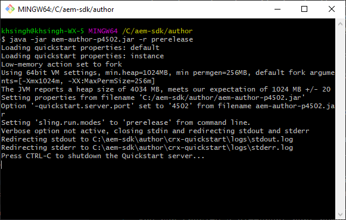

# 로컬 개발 환경 설정 {#headless-adaptive-forms-setup-development-environment}

로컬 개발 환경을 설정하여 로컬 컴퓨터에서 Headless 적응형 양식을 만들고 테스트할 수 있습니다. 개발 환경은 AEM SDK와 AEM SDK에 설치된 AEM Forms 기능 아카이브로 구성됩니다.
<!--
 After a Headless adaptive form or related assets are ready on the local development environment, you can deploy the Headless adaptive form application to your publishing environment. -- >

You require knowledge to build application using react, Git, and Maven to use Headless adaptive forms.

<!-- 

### Download the latest version of AEM as a Cloud Service SDK or Forms feature archive (AEM Forms add-on) from Software Distribution {#software-distribution}

To download the supported version of Adobe Experience Manager as a Cloud Service SDK or Forms feature archive (AEM Forms add-on):

1. Log in to [Software Distribution](https://experience.adobe.com/#/downloads) portal with your Adobe ID.

    >[!NOTE]
    >
    > Your Adobe Organization must be provisioned for AEM as a Cloud Service to download the AEM as a Cloud Service SDK.

1. Navigate to the **[!UICONTROL AEM as a Cloud Service]** tab.
1. Sort by published date in descending order.
1. Click on the latest Adobe Experience Manager as a Cloud Service SDK or Forms feature archive (AEM Forms add-on).
1. Review and accept the EULA. Tap the **[!UICONTROL Download]** button. -->

## 시스템 요구 사항 {#headless-adaptive-forms-system-requirements}

AEM SDK를 설치하려면 로컬 시스템이 다음 최소 요구 사항을 충족해야 합니다.

* [Java 개발 키트 11](https://experience.adobe.com/#/downloads/content/software-distribution/en/general.html?1_group.propertyvalues.property=.%2Fjcr%3Acontent%2Fmetadata%2Fdc%3AsoftwareType&amp;1_group.propertyvalues.operation=equals&amp;1_group.propertyvalues.0_values=software-type%3Atoling&amp;fulltext=Oracle%7E+JDK%7E+11%7E&amp;orderby=%40jcr%3Acontent%2Fjcr%3AlastModified&amp;orderby.sort=desc&amp;layout=list&amp;p.offset=0&amp;p.limit=14)
* [Git 최신 릴리스](https://git-scm.com/downloads). Git을 처음 사용하는 경우 [Git 설치](https://git-scm.com/book/en/v2/Getting-Started-Installing-Git)를 참조하십시오.
* [Node.js 16.13.0 이상](https://nodejs.org/en/download/). Node.js를 처음 사용하는 경우 [Node.js 설치 방법](https://nodejs.dev/en/learn/how-to-install-nodejs)을 참조하세요.
* [Maven 3.6 이상](https://maven.apache.org/download.cgi) Maven을 처음 사용하는 경우 [Apache Maven 설치](https://maven.apache.org/install.html)를 참조하십시오.

## 개발 환경 설정 {#headless-adaptive-forms-procedure-to-setup-development-environment}

새로운 로컬 개발 환경을 설정하고 이를 사용하여 Headless 적응형 양식을 개발 및 테스트하려면:

1. [AEM as a Cloud Service SDK를 설정합니다](#setup-author-instance).
1. [AEM SDK에 AEM Forms 아카이브(AEM Forms Cloud Service 추가 기능)를 추가](#add-forms-archive)합니다.

<!--

1. (Optional) [Add Forms-specific users to your local Author instance](#configure-users-and-permissions).
1. (Optional) Install [Adaptive forms builder extension for Microsoft Visual Studio Code](#microsoft-visual-studio-code-extension-for-headless-adaptive-forms). 

-->

### 1. AEM as a Cloud Service SDK 설정 {#setup-author-instance}

AEM as a Cloud Service SDK(AEM SDK)는 개발자에게 Headless 적응형 양식을 만들고 테스트할 수 있는 로컬 환경을 제공합니다. AEM as a Cloud Service SDK를 사용하여 Headless 적응형 양식을 만들고 미리 볼 수 있으므로 개발과 관련된 대부분의 유효성 검사를 로컬에서 수행할 수 있습니다. 로컬 작성자 인스턴스를 설정하려면:

1. [최신 [!DNL Adobe Experience Manager] as a Cloud Service SDK를 다운로드](https://experience.adobe.com/#/downloads/content/software-distribution/en/aemcloud.html)합니다. 게시된 날짜 열을 사용하여 최신 SDK를 정렬하고 쉽게 찾을 수 있습니다.
.zip 형식입니다. 지원되는 버전은 aem-sdk-2022.7.8085.20220725T140323Z-220700.zip 이상입니다.

   


1. 다운로드한 .zip 파일을 로컬 컴퓨터의 디렉토리에 추출합니다.
1. 작성자 인스턴스의 설치 위치로 사용할 디렉터리를 로컬 컴퓨터에 만듭니다. 예: `~/aem-sdk/author`
1. 추출된 SDK 파일에서 .jar 파일을 설치 위치로 복사하고 파일 이름을 `aem-author-p4502.jar`(으)로 변경합니다. 파일 이름의 `p4502` 문자열은 사용할 포트 번호를 지정합니다. 다른 포트 번호를 지정할 수도 있습니다.

   >[!NOTE]
   >
   > .jar 파일을 두 번 클릭하여 시작하지 마십시오. [오류](https://experienceleague.adobe.com/docs/experience-manager-learn/cloud-service/local-development-environment-set-up/aem-runtime.html?lang=en#troubleshooting-double-click)가 발생합니다.

1. 명령 프롬프트를 엽니다.
   * Windows에서는 **관리자 권한으로 실행** 옵션을 사용하여 관리자 모드로 명령 프롬프트를 엽니다.
   * Linux에서는 터미널 창을 루트 사용자로 열어야 합니다.

1. 복사된 .jar 파일이 포함된 설치 위치로 이동하고 다음 명령을 실행합니다.

   `java -jar aem-author-p4502.jar -r prerelease`

   

   * `-r prerelease` 스위치를 사용하면 프리릴리스 및 제한된 릴리스 프로그램에서만 사용할 수 있는 기능을 사용할 수 있습니다.
   * 로컬 개발에 `admin`을(를) 사용자 이름 및 암호로 사용하여 인지 부하를 줄일 수 있습니다.

   AEM이 시작되면 웹 브라우저에 로그인 페이지가 열립니다. 웹 브라우저에서 주소 `http://localhost:<port>`의 AEM SDK 인스턴스에 대한 로그인 페이지를 열 수도 있습니다. 예: [http://localhost:4502](http://localhost:4502).

1. 작성자 인스턴스에 로그인합니다.  아이콘을 탭하고 Adobe Experience Manager 정보를 탭한 다음 버전 번호에 프리릴리스 포스트픽스가 포함되어 있는지 확인하십시오.

   

프리릴리스 포스트픽스가 표시되지 않으면 서버를 중지하고 `[AEM SDK installation]/crx-quickstart folder`을(를) 삭제한 다음 `-r prerelease` 스위치를 사용하여 AEM SDK .jar 파일을 다시 시작하십시오. 추가 옵션은 [문제 해결](/help/troubleshooting.md)을 참조하십시오.

### 2. AEM SDK에 AEM Forms 아카이브(AEM Forms Cloud Service 추가 기능) 추가 {#add-forms-archive}

AEM Forms as a Cloud Service 기능(AEM Forms Cloud Service 추가 기능)에서는 로컬 개발 환경에서 Headless 적응형 양식을 만들 수 있는 도구를 제공합니다. 기능 아카이브를 설치하려면:

1. [소프트웨어 배포](https://experience.adobe.com/#/downloads/content/software-distribution/en/aemcloud.html?fulltext=AEM*+Forms*+add*+on*&amp;orderby=%40jcr%3Acontent%2Fjcr%3AlastModified&amp;orderby.sort=desc&amp;layout=list&amp;p.offset=0&amp;p.limit=20)에서 최신 [!DNL AEM Forms] 기능 보관(AEM Forms 추가 기능)을 다운로드하고 추출하십시오. 게시된 날짜 열을 사용하여 최신 SDK를 정렬하고 쉽게 찾을 수 있습니다. 지원되는 버전은 aem-forms-addon-2022.07.06.02-220600 이상입니다.

1. crx-quickstart/install 디렉토리로 이동합니다. 폴더가 없으면 만듭니다.
1. AEM SDK 인스턴스를 중지합니다. AEM SDK 인스턴스를 실행 중인 명령 프롬프트 창을 종료하여 AEM을 중지할 수 있습니다.
1. 1단계에서 추출한 `aem-forms-addon-<version>.far` 파일의 [!DNL AEM Forms] 추가 기능 보관 파일을 설치 폴더로 복사합니다.
1. 다음 명령을 사용하여 AEM SDK 인스턴스를 다시 시작합니다.

   `java -jar aem-author-p4502.jar -r prerelease`

<!-- 

### 3. (Optional) Configure users and permissions {#configure-users-and-permissions}

Create seperate user accounts for Form Developer, Form Practitioner, and end users. These account help you test Headless adaptive forms for various types of users. To create a user account and add roles to the account:

1. Login to your AEM SDK instance.
1. Go to Tools > Security > Users and tap Create. The Create New User wizard opens.
1. In the details tab, specify an ID and Password. All other fields are optional. It is recommended to provide name and an email address.
1. In the Groups tab, search and select user-groups for a user depending on their role. The table below lists all types of users and pre-defined groups for each type of forms users based on their role:
  
    | User Type | AEM Group |
    |---|---|
    | Form developer | [!DNL forms-users] (AEM Forms Users), [!DNL template-authors], [!DNL workflow-users], [!DNL workflow-editors], and [!DNL fdm-authors]  |
    | Customer Experience Lead or UX Designer| [!DNL forms-users], [!DNL template-authors]|
    | AEM administrator | [!DNL aem-administrators], [!DNL fd-administrators] |
    | End user| When a user must log in to view and submit an Adaptive Form, add such users to [!DNL forms-users] group. </br> When no user authentication is required to access Adaptive Forms, do not assign any group to such users.|

<!-- ### 4. (Optional) Install Visual Studio Code extension for Headless adaptive forms {#microsoft-visual-studio-code-extension-for-headless-adaptive-forms}

You can use any IDE for developing Headless adaptive forms. Adobe provides an extension for Microsoft&reg;reg; Visual Studio Code to make it easier for you to navigate structure and develop Headless adaptive forms. The extension adds adaptive forms related IntelliSense capabilities and helps auto-complete Headless adaptive forms JSON syntax. It also adds a panel, titled Forms Tree, to help navigate structure of Headless adaptive form. To use the extension: 

1. Ensure [Microsoft Visual Studio Code 1.62.0 or later](https://code.visualstudio.com/docs/supporting/FAQ#_how-do-i-find-the-version) is installed. If you have an older version or no version installed, download the latest version from [Microsoft Website](https://code.visualstudio.com/docs/setup/setup-overview)
   >[!NOTE]
   >
   >
   > To use Visual Studio from command line on macOS, see [Launching from the command line](https://code.visualstudio.com/docs/setup/mac#_launching-from-the-command-line).

1. Download the [Adaptive forms builder extension](/help/assets/adaptive-form-builder-0.12.0.vsix).

1. Navigate the directory containing the *adaptive-form-builder-[version].vsix* file.

1. Run the following command or see [Install from a VSIX](https://code.visualstudio.com/docs/editor/extension-marketplace#_install-from-a-vsix) article for detailed instructions to install a Visual Studio Code extension from a VSIX file:

    `code -–install-extension adaptive-form-builder-[version].vsix`

    </br> Replace the [version] with actual version of the extension. For example, `code -–install-extension adaptive-form-builder-0.12.0.vsix`

    </br> 

    

<!-- ## Create and setup a react app

Adaptive forms renderer component is a react based component. It requires a react app to run and render a Headless adaptive form. To create and setup react app:

1. Open terminal in Visual Studio code and run the following command to create a react app and installs all related dependencies:

    ```shell
    npx create-react-app [react-app-name] --scripts-version 4.0.3 --template typescript
    ```

    Where [react-app-name] represents name of the project, script version is 4.0.3, and template of type typescript. For example, the following command creates a react app named *headless-forms-demo*.

    ```shell
    npx create-react-app headless-forms-demo --scripts-version 4.0.3 --template typescript
    ```

    It may take some time to create the react app and install all the dependencies. The command creates an empty react app with latest version of react and react-dom dependencies. It does not have any artifacts related to adaptive forms renderer component.

1. Adaptive forms renderer component is based on react spectrum and requires react 16.0.0 and react-dom 16.0.0. To install react 16.0.0 and related dependencies:
    1. Open the Visual Studio code terminal Window or command prompt.
    1. Navigate to the directory of react project.  
    1. Run the following command:

        ```shell
        npm install --save react@16.0.0 react-dom@16.14.0 -force
        ```

1. Run the following command to install adaptive forms renderer component related dependencies:

    ```shell
    npm i --save @aemforms/forms-super-component @aemforms/forms-react-core-components @aemforms/forms-super-component @adobe/react-spectrum @react/react-spectrum
    ```

<!-- 1. Install dependencies for adaptive forms renderer component. Packages for these dependencies are available in Adobe Artifactory. To authenticate with Adobe Artifactory and install dependencies for adaptive forms renderer component:

    1. Create environment variables ARTIFACTORY_USER and ARTIFACTORY_API_TOKEN. The ARTIFACTORY_USER stores Adobe LDAP username and ARTIFACTORY_API_TOKEN stores your [Adobe Artifactory token](https://wiki.corp.adobe.com/display/Artifactory/API+Keys)

    1. Run the following command to set NPM_TOKEN and NPM_EMAIL tokens:

        ```shell

        auth=$(curl -s -u${ARTIFACTORY_USER}:${ARTIFACTORY_API_TOKEN} https://artifactory.corp.adobe.com/artifactory/api/npm/auth)
        export NPM_TOKEN=$(echo "${auth}" | grep "_auth" | awk -F " " '{ print $3 }')
        export NPM_EMAIL=$(echo "${auth}" | grep "email" | awk -F " " '{ print $3 }')
        ```

        These tokens are required to communicated with Adobe Artifactory.

    1. Create a .npmrc file in the react project.

        

    1. Add the following code to the file:

        ```shell
        @aemforms:registry=https://artifactory.corp.adobe.com/artifactory/api/npm/npm-aem-release/
        @react:registry=https://artifactory.corp.adobe.com/artifactory/api/npm/npm-react-release/
        @quarry:registry=https://artifactory.corp.adobe.com/artifactory/api/npm/npm-adobe-release-local/
        //artifactory.corp.adobe.com/artifactory/api/npm/npm-adobe-release-loca/:_auth=${NPM_TOKEN}
        //artifactory.corp.adobe.com/artifactory/api/npm/npm-aem-release/:_auth=${NPM_TOKEN}
        //artifactory.corp.adobe.com/artifactory/api/npm/npm-react-release/:_auth=${NPM_TOKEN}
        _auth=${NPM_TOKEN}
        email=${NPM_EMAIL}
        always-auth=true
        ```

        It defines the antifactory repositories to use for Headless adaptive forms, react, and quarry related scope.
    1. Run the following command to install adaptive forms renderer component related dependencies:

    ```shell
    npm i --save @aemforms/crispr-react-bindings @aemforms/crispr-react-core-components @adobe/react-spectrum @react/react-spectrum
    ```
 
-->
로컬 환경이 준비되었습니다. Headless 적응형 양식을 계속 만들 수 있습니다.
