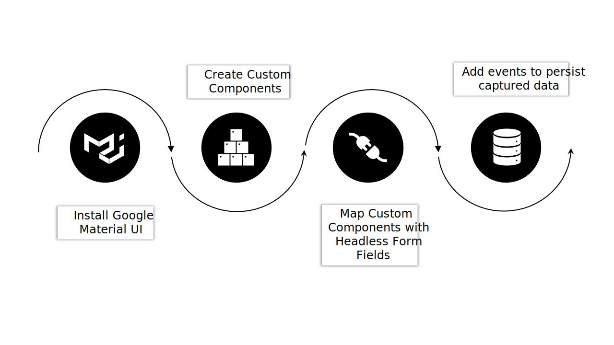

# 사용자 지정 React 라이브러리를 사용하여 Headless 양식 렌더링

사용자 지정 구성 요소를 만들고 구현하여 조직의 요구 사항과 지침에 따라 Headless 적응형 양식의 모양과 기능(비헤이비어)을 사용자 지정할 수 있습니다.

이러한 구성 요소는 두 가지 주요 용도, 즉 양식 필드의 모양이나 스타일을 제어하고 이러한 필드를 통해 수집된 데이터를 양식 모델 인스턴스 내에 저장하는 역할을 합니다. 이 내용이 혼란스럽게 들릴 경우 걱정하지 마십시오. 잠시 후 자세한 내용을 살펴보겠습니다. 지금은 사용자 지정 구성 요소를 만들고, 이러한 구성 요소를 사용하여 양식을 렌더링하고, 이벤트를 사용하여 REST 끝점에 데이터를 저장하고 제출하는 초기 단계에 초점을 맞추겠습니다.

이 자습서에서는 Google Material UI 구성 요소를 사용하여 사용자 지정 React 구성 요소를 사용하여 Headless 적응형 양식을 렌더링하는 방법을 보여 줍니다. 그러나 이 라이브러리에 제한되지 않으며 모든 React 구성 요소 라이브러리를 자유롭게 활용하거나 사용자 정의 구성 요소를 개발할 수 있습니다.

이 문서의 결론에 따라 _연락처_ 양식 작성 위치 [스타터 키트를 사용하여 Headless 양식 만들기 및 게시](create-and-publish-a-headless-form.md) 문서가 다음과 같이 변형됩니다.


Google Material UI 구성 요소를 사용하여 양식을 렌더링하는 것과 관련된 주요 단계는 다음과 같습니다.



## 1. Google Material UI 설치

기본적으로 시작 키트는 [Adobe 스펙트럼](https://spectrum.adobe.com/) 구성 요소. 을 사용하도록 설정합니다. [Google의 자료 UI](https://mui.com/):

1. 시작 키트가 실행되고 있지 않은지 확인합니다. 시작 키트를 중지하려면 터미널을 열고 **react-starter-kit-aem-headless-forms**&#x200B;을 클릭하고 Ctrl-C를 누릅니다. (Windows, Mac 및 Linux에서도 마찬가지입니다.)

   터미널을 닫지 마십시오. 터미널을 닫아도 스타터 키트가 중지되지 않습니다.

1. 다음 명령을 실행합니다.

```shell
    
    npm install @mui/material @emotion/react @emotion/styled --force
    
```

Google Material UI npm 라이브러리를 설치하고 시작 키트 종속성에 라이브러리를 추가합니다. 이제 Material UI 구성 요소를 사용하여 양식 구성 요소를 렌더링할 수 있습니다.


## 2. 사용자 지정 React 구성 요소 만들기

기본값을 대체할 사용자 정의 구성 요소를 만들어 보겠습니다. [텍스트 입력](https://spectrum.adobe.com/page/text-field/) 구성 요소 [Google 자료 UI 텍스트 필드](https://mui.com/material-ui/react-text-field/) 구성 요소.

각 구성 요소 유형에 대해 별도의 구성 요소가 필요합니다([fieldType](https://opensource.adobe.com/aem-forms-af-runtime/storybook/?path=/story/reference-json-properties-fieldtype--text-input) 또는 :type)이 Headless 양식 정의에 사용됩니다. 예를 들어 이전 섹션에서 만든 연락처 양식에서는 유형의 이름, 이메일 및 전화 필드를 사용합니다 `text-input` ([fieldType: &quot;text-input&quot;](https://opensource.adobe.com/aem-forms-af-runtime/storybook/?path=/docs/adaptive-form-components-text-input-field--def)) 및 메시지 필드는 유형임 `multiline-input` ([&quot;fieldType&quot;: &quot;multiline-input&quot;](https://opensource.adobe.com/aem-forms-af-runtime/storybook/?path=/docs/reference-json-properties-fieldtype--multiline-input)).


을 사용하는 모든 양식 필드에 오버레이할 사용자 지정 구성 요소를 만들어 보겠습니다. [fieldType: &quot;text-input&quot;](https://opensource.adobe.com/aem-forms-af-runtime/storybook/?path=/docs/adaptive-form-components-text-input-field--def) 속성 포함 [자료 UI 텍스트 필드](https://mui.com/material-ui/react-text-field/) 구성 요소.


사용자 지정 구성 요소를 만들고 사용자 지정 구성 요소를 [fieldType](https://opensource.adobe.com/aem-forms-af-runtime/storybook/?path=/docs/adaptive-form-components-text-input-field--def) 속성 :

1. 를 엽니다. **react-starter-kit-aem-headless-forms** 코드 편집기의 디렉터리로 이동하여 `\react-starter-kit-aem-headless-forms\src\components`.


1. 의 복사본 만들기 **슬라이더** 또는 **richtext** 폴더를 복사한 다음 복사한 폴더의 이름을 로 바꿉니다. **materialtextfield**. Slider와 richtext는 스타터 앱에서 사용할 수 있는 두 가지 샘플 사용자 지정 구성 요소입니다. 이러한 구성 요소를 사용하여 사용자 지정 구성 요소를 만들 수 있습니다.

   

1. 를 엽니다. `\react-starter-kit-aem-headless-forms\src\components\materialtextfield\index.tsx` 기존 코드를 아래 코드로 바꿉니다. 이 코드는 을 반환하고 렌더링합니다. [Google 자료 UI 텍스트 필드](https://mui.com/material-ui/react-text-field/) 구성 요소.

```JavaScript
 
     import React from 'react';
     import {useRuleEngine} from '@aemforms/af-react-renderer';
     import {FieldJson, State} from '@aemforms/af-core';
     import { TextField } from '@mui/material';
     import Box from '@mui/material/Box';
     import { richTextString } from '@aemforms/af-react-components';
     import Typography from '@mui/material/Typography';


     const MaterialtextField = function (props: State<FieldJson>) {

         const [state, handlers] = useRuleEngine(props);

         return(

         <Box>
             <Typography component="legend">{state.visible ? richTextString(state?.label?.value): ""} </Typography>
             <TextField variant="filled"/>
         </Box>

         )
     }

     export default MaterialtextField;
```


다음 `state.visible` 부품은 컴포넌트가 표시되도록 설정되어 있는지 확인합니다. 필드의 레이블이 이면 을 사용하여 검색되고 표시됩니다. `richTextString(state?.label?.value)`.


사용자 지정 구성 요소 `materialtextfield` 준비되었습니다. 이 사용자 지정 구성 요소를 설정하여 의 모든 인스턴스를  [fieldType: &quot;text-input&quot;](https://opensource.adobe.com/aem-forms-af-runtime/storybook/?path=/docs/adaptive-form-components-text-input-field--def) (Google 재질 UI 텍스트 필드 사용)

## 3. Headless 양식 필드에 사용자 지정 구성 요소 매핑

서드파티 라이브러리 구성 요소를 사용하여 양식 필드를 렌더링하는 프로세스를 매핑이라고 합니다. 각각 매핑합니다([fieldType](https://opensource.adobe.com/aem-forms-af-runtime/storybook/?path=/story/reference-json-properties-fieldtype--text-input))을 타사 라이브러리의 해당 구성 요소에 연결합니다.

모든 매핑 관련 정보가 `mappings.ts` 파일. 다음 `...mappings` 다음 문으로 바꿉니다 `mappings.ts` 파일은 기본 매핑을 참조하며 ([fieldType](https://opensource.adobe.com/aem-forms-af-runtime/storybook/?path=/story/reference-json-properties-fieldtype--text-input) 또는 :type) [Adobe 스펙트럼](https://spectrum.adobe.com/page/text-field/) 구성 요소.

에 대한 매핑을 추가하려면  `materialtextfield` 구성 요소, 마지막 단계에서 생성됨:

1. 를 엽니다. `mappings.ts` 파일.

1. 다음을 포함하려면 가져오기 구문을 추가하십시오. `materialtextfield` 구성 요소를 `mappings.ts` 파일:


   ```JavaScript
       import MaterialtextField from "../components/materialtextfield";
   ```

1. 다음 문을 추가하여 `text-input` materialtextfield 구성 요소 포함


   ```JavaScript
       "text-input": MaterialtextField
   ```

   파일의 최종 코드는 다음과 같습니다.

   ```JavaScript
         import { mappings } from "@aemforms/af-react-components";
         import MaterialtextField from "../components/materialtextfield";
   
   
         const customMappings: any = {
           ...mappings,
           "text-input": MaterialtextField
        };
        export default customMappings;
   ```

1. 앱을 저장하고 실행합니다. 양식의 처음 세 필드는 다음을 사용하여 렌더링됩니다. [Google 자료 UI 텍스트 필드](https://mui.com/material-ui/react-text-field/):

   


   마찬가지로 메시지(&quot;fieldType&quot;: &quot;multiline-input&quot;)에 대한 사용자 지정 구성 요소를 만들고 서비스(&quot;fieldType&quot;:&quot;number-input&quot;) 필드에 대한 등급을 지정할 수 있습니다. 메시지의 사용자 지정 구성 요소에 대한 다음 Git 저장소를 복제하고 서비스 필드에 대한 등급을 지정할 수 있습니다.

   [https://github.com/singhkh/react-starter-kit-aem-headless-forms](https://github.com/singhkh/react-starter-kit-aem-headless-forms)

## 다음 단계

Google Material UI를 사용하는 사용자 지정 구성 요소로 양식을 성공적으로 렌더링했습니다. 제출 단추(해당 Google Material UI 구성 요소와 매핑됨)를 클릭하여 양식을 제출해 보셨나요? 만약 그렇지 않다면, 가서 시도해 보세요.

양식이 데이터를 데이터 소스에 제출합니까? 아니요? 걱정하지 마십시오. 런타임 라이브러리와 통신하도록 양식이 구성되지 않았기 때문입니다.

양식과 통신할 수 있도록 양식을 구성하려면 어떻게 해야 합니까? 모든 것을 자세히 설명하는 기사가 곧 나옵니다. 기다려 주십시오.
